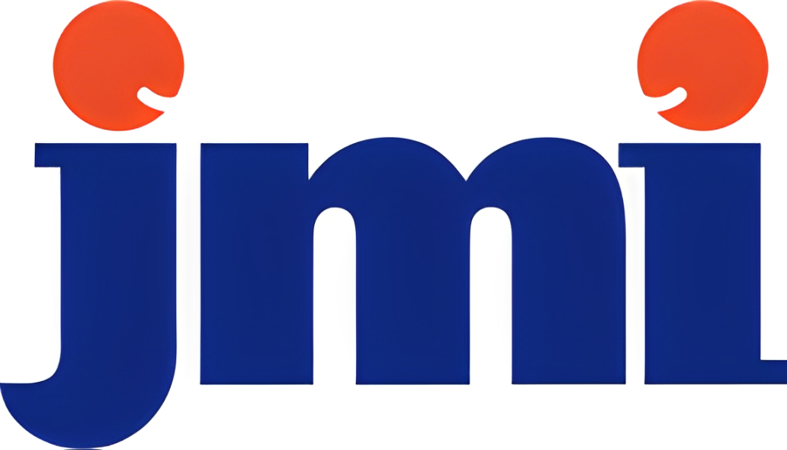

# 🏢 Asset Management System

[](https://codeigniter.com)
[](https://php.net)
[](LICENSE)
[](https://github.com/Sandysan1234/asset-mgmt)

> 💼 **Sistem Manajemen Aset Berbasis Web** — Aplikasi lengkap untuk mengelola, melacak, dan memantau aset perusahaan secara digital. Dibangun dengan CodeIgniter 4 untuk performa cepat, keamanan terjamin, dan kemudahan pengembangan.

<p align="center">
  
  <br><em>📊 Dashboard Monitoring Aset Real-time</em>
</p>

---

## 📋 Daftar Isi

- [✨ Fitur Utama](#-fitur-utama)
- [🎯 Manfaat untuk Bisnis](#-manfaat-untuk-bisnis)
- [👥 Role & Akses Pengguna](#-role--akses-pengguna)
- [🛠 Teknologi](#-teknologi)
- [🚀 Instalasi & Konfigurasi](#-instalasi--konfigurasi)
- [📁 Struktur Proyek](#-struktur-proyek)
- [🔐 Keamanan & Best Practice](#-keamanan--best-practice)
- [🧪 Support & Appreciation](#-support--appreciation)


---

## ✨ Fitur Utama

### 📦 Manajemen Aset
- ➕ **Tambah/Edit/Hapus Aset** — Kelola data aset lengkap: nama, kategori, serial number, lokasi, kondisi, nilai, tanggal perolehan
- 🔍 **Pencarian & Filter Canggih** — Cari aset berdasarkan nama, kategori, status, lokasi, atau tanggal
- 🏷️ **Kategorisasi Aset** — Kelompokkan aset: Elektronik, Kendaraan, Furniture, IT Equipment, dll.
- 📸 **Upload Foto/Dokumen** — Lampirkan foto aset, faktur, garansi, atau dokumen pendukung

### 🔄 Siklus Hidup Aset
- 📊 **Tracking Status Aset** — Available, In Use, Maintenance, Retired, Lost
- 📅 **Jadwal Maintenance** — Atur reminder servis berkala untuk aset kritis
- 📉 **Depresiasi Otomatis** — Hitung penyusutan nilai aset berdasarkan metode straight-line atau declining balance
- 🗑️ **Asset Disposal** — Kelola proses penghapusan/penjualan aset dengan audit trail

### 👥 Penugasan & Peminjaman
- 🧑‍💼 **Assign ke Karyawan/Departemen** — Lacak siapa yang menggunakan aset apa
- 📋 **Form Peminjaman Digital** — Ajukan, approve, dan kembalikan aset dengan alur kerja terstruktur
- 📬 **Notifikasi Pengembalian** — Email reminder untuk aset yang belum dikembalikan

### 📈 Reporting & Analytics
- 📊 **Dashboard Statistik** — Ringkasan total aset, nilai aset, aset dalam maintenance, dll.
- 📄 **Laporan Kustom** — Export laporan ke PDF/Excel: daftar aset, riwayat maintenance, laporan depresiasi
- 📅 **Audit Log** — Catat semua perubahan data aset untuk keperluan compliance

### 🔐 Manajemen Pengguna
- 👮 **Role-Based Access Control** — Admin, Manager, Staff, Viewer dengan hak akses berbeda
- 🔑 **Authentication & Session Management** — Login aman dengan proteksi CSRF & XSS
- 🧾 **Activity Log** — Pantau aktivitas user untuk keamanan dan troubleshooting

---

## 🎯 Manfaat untuk Bisnis

| Manfaat | Deskripsi |
|---------|-----------|
| ✅ **Efisiensi Operasional** | Kurangi waktu pencarian aset fisik dengan sistem digital terpusat |
| ✅ **Penghematan Biaya** | Hindari pembelian ganda & optimalkan utilisasi aset yang ada |
| ✅ **Kepatuhan & Audit** | Dokumen lengkap untuk audit internal/eksternal & pelaporan keuangan |
| ✅ **Preventive Maintenance** | Kurangi downtime dengan jadwal perawatan yang terjadwal |
| ✅ **Decision Support** | Data real-time untuk perencanaan pengadaan & penghapusan aset |

---

## 👥 Role & Akses Pengguna
- 🔹 Super Admin ── Akses penuh: kelola user, konfigurasi sistem, -backup database
- 🔹 Asset Manager ── Kelola data aset, approve peminjaman, generate laporan, jadwalkan maintenance
- 🔹 Staff/Employee ── Ajukan peminjaman, lihat aset yang ditugaskan, update kondisi aset
- 🔹 Viewer/Auditor ── Read-only: lihat dashboard & laporan tanpa bisa mengubah data


---

## 🛠 Teknologi

### Backend
- 🐘 **PHP 8.1+** dengan **CodeIgniter 4** — Framework ringan, cepat, dan aman
- 🗄️ **MySQL/MariaDB** — Database relasional untuk penyimpanan data terstruktur
- 📦 **Composer** — Dependency management modern

### Frontend
- 🎨 **Bootstrap 5** — Responsive UI yang konsisten di semua device
- ⚡ **jQuery** — Interaktivitas ringan tanpa bundle berat
- 📱 **Mobile Friendly** — Akses via smartphone/tablet tanpa masalah

### Tools & Integrasi
- 📧 **Email Service** — Notifikasi peminjaman, maintenance, pengembalian
- 📄 **PDF Export** — Generate laporan profesional dengan DomPDF/TCPDF
- 📊 **Chart.js** — Visualisasi data aset yang informatif
- 🔐 **Environment Variables** — Konfigurasi aman via file `.env`

---

## 🚀 Instalasi & Konfigurasi

### 📦 Prasyarat Sistem
```bash
✅ PHP >= 8.1 dengan ekstensi: intl, mbstring, json, mysqlnd, curl
✅ Composer >= 2.0
✅ MySQL 5.7+ / MariaDB 10.3+
✅ Web Server: Apache/Nginx (dengan mod_rewrite)
✅ Git
```

## 🔧 Langkah Instalasi
``` bash
# 1. Clone repository
git clone https://github.com/Sandysan1234/asset-mgmt.git
cd asset-mgmt

# 2. Install dependencies PHP
composer install

# 3. Setup environment
cp env .env
# 👉 Edit file .env sesuai konfigurasi server Anda

# 4. Konfigurasi database di .env
database.default.hostname = localhost
database.default.database = your_db
database.default.username = root
database.default.password = your_password
database.default.DBDriver = MySQLi

# 5. Jalankan migration & seeder
php spark migrate --all
php spark db:seed AssetSeeder
php spark db:seed UserSeeder

# 6. Set permission folder writable
chmod -R 775 writable

# 7. Jalankan development server
php spark serve
# 🌐 Akses: http://localhost:8080
```
## 📁 Struktur Proyek

```
asset-mgmt/
├── app/
│   ├── Controllers/
│   │   ├── AssetController.php      # CRUD aset
│   │   ├── AssignmentController.php # Penugasan & peminjaman
│   │   ├── ReportController.php     # Generate laporan
│   │   ├── AuthController.php       # Login & manajemen user
│   │   └── ...
│   ├── Models/
│   │   ├── AssetModel.php           # Logic data aset
│   │   ├── CategoryModel.php        # Kategori aset
│   │   ├── MaintenanceModel.php     # Jadwal maintenance
│   │   ├── UserModel.php            # Data pengguna
│   │   └── ...
│   ├── Views/
│   │   ├── assets/                  # Tampilan manajemen aset
│   │   ├── assignments/             # Form peminjaman & penugasan
│   │   ├── reports/                 # Template laporan
│   │   ├── layouts/                 # Header, sidebar, footer
│   │   └── auth/                    # Login & register
│   ├── Config/
│   │   ├── Routes.php               # Definisi URL routing
│   │   ├── Database.php             # Konfigurasi DB
│   │   └── ...
│   └── Filters/
│       ├── AuthFilter.php           # Proteksi route login
│       └── RoleFilter.php           # Cek hak akses berdasarkan role
│
├── public/
│   ├── index.php                    # Entry point aplikasi
│   ├── css/, js/, img/              # Asset statis frontend
│   └── .htaccess                    # URL rewriting untuk Apache
│
├── writable/
│   ├── uploads/                     # Foto & dokumen aset
│   ├── logs/                        # Log aplikasi
│   └── cache/                       # Cache sistem
│
├── tests/                           # Unit & feature tests
├── database/
│   ├── migrations/                  # Skema database versioned
│   └── seeds/                       # Data awal untuk development
│
├── .env                             # Environment variables (JANGAN commit!)
├── .gitignore
├── composer.json
├── spark                            # CLI tool CodeIgniter
└── README.md
```
## 🔐 Keamanan & Best Practice
### 🛡️ Fitur Keamanan Bawaan
- ✅ CSRF Protection — Mencegah serangan Cross-Site Request Forgery
- ✅ XSS Filtering — Sanitasi input otomatis untuk cegah script injection
- ✅ Prepared Statements — Query database aman dari SQL Injection
- ✅ Password Hashing — Simpan password dengan password_hash() (bcrypt)
- ✅ Session Security — Regenerasi session ID & timeout otomatis

## 🌟 Support & Appreciation
Jika proyek ini membantu pekerjaan Anda, dukung dengan cara:
#### ⭐ Beri bintang di GitHub — Bantu proyek ini lebih dikenal
#### 🐦 Share di media sosial — Bagikan ke rekan yang membutuhkan
#### 💬 Beri feedback — Ceritakan pengalaman atau saran pengembangan

``` bash
# 🚀 Quick Start dalam 30 detik:
git clone https://github.com/Sandysan1234/asset-mgmt.git
cd asset-mgmt && composer install
cp .env.example .env && php spark migrate --all
php spark serve
# Buka http://localhost:8080 dan mulai kelola aset Anda! 🎯
```


